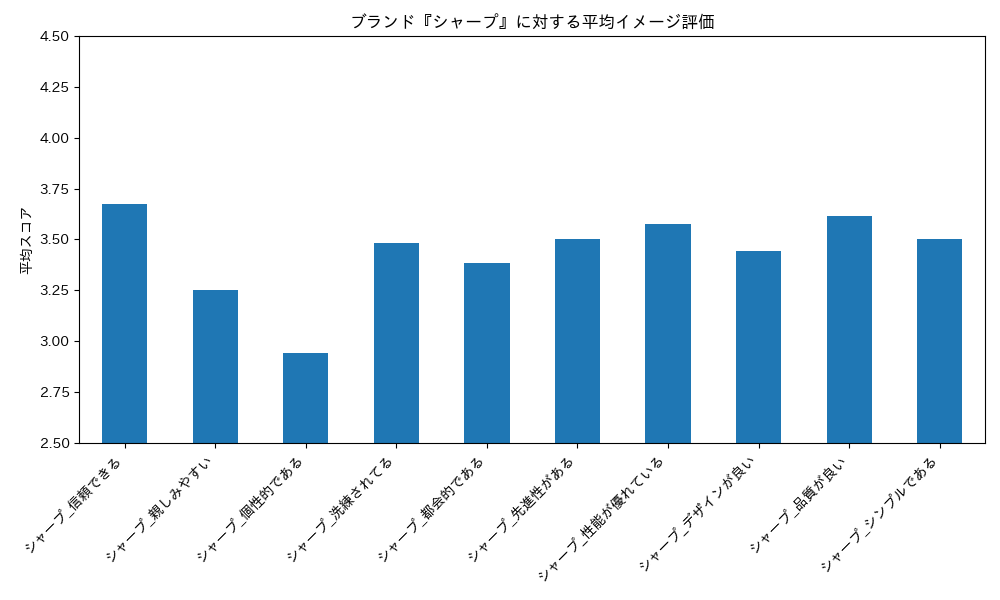
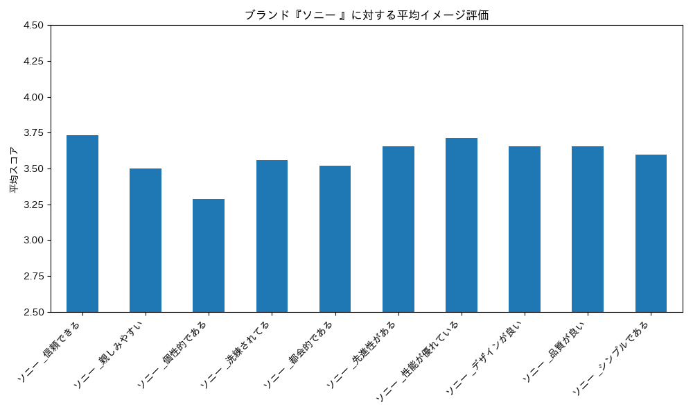

# Report: 各会社の評価について

## 1. 企業ごとの評価値推移

以下の図は、シャープに対するイメージ評価について平均した結果である。シャープは、これを見ると以下の2つのことが分かる。

- 「信頼できる」のイメージ評価が最も高い
- 「個性的である」のイメージ評価が圧倒的に低い

ただし、上記の傾向については統計的に有意な傾向であるか否は不明である。よって、統計的仮説検定を実施することとする。

### ソニーについて

ソニーは「Play Station」等のゲームや音響などを主に提供している。以下の図は、ソニーに対するイメージ評価について平均した結果である。これを見ると以下の2つのことが分かる。

- 評価推移は、シャープとほぼ同一な傾向を有している
- 「信頼できる」のイメージ評価が最も高い
- 「個性的である」のイメージ評価が圧倒的に低い

ソニーは、音響やただし、上記の傾向については統計的に有意な傾向であるか否は不明である。よって、統計的仮説検定を実施することとする。

